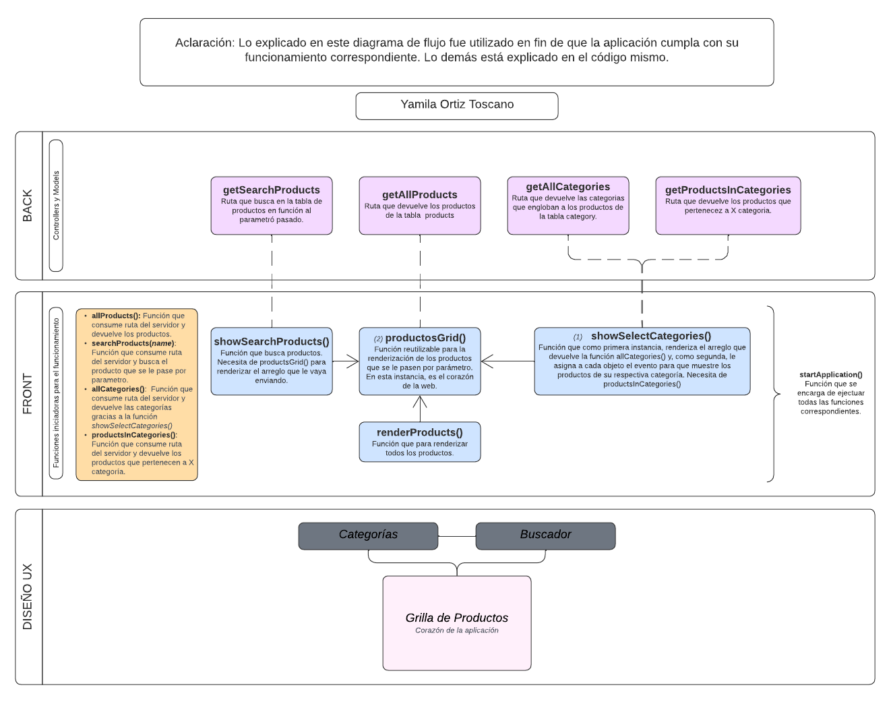
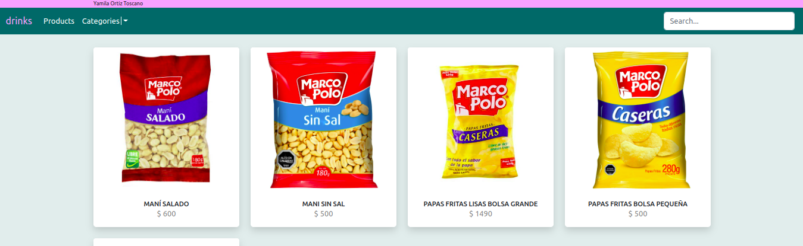
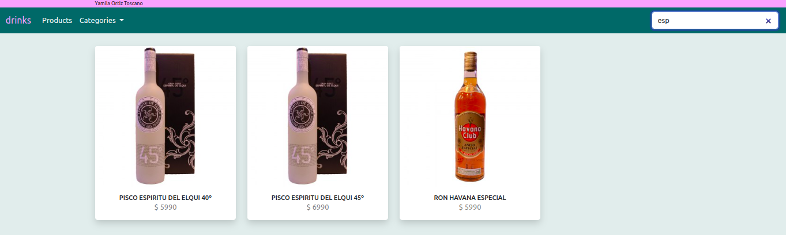

# Desafío Producto BSALE
- Lenguajes Frontend: Vanilla JS, HTML
- Librería de Estilos: Bootstrap
- Lenguajes Backend: Mysql, SQL, Express, NodeJS.
- Hosting Frontend: Vercel
- Hosting Backend: Render

### Generalidades

El equipo de Bsale me ha puesto a disposición una API, la cual permite acceder a un conjunto de métodos orientados a facilitar la integración, desde sistemas externos hacia Bsale.

Estos métodos permitirán obtener información desde Bsale. Así, por ejemplo, obtener productos y datos para su usabilidad.

Esta API permite llamadas del tipo REST y utiliza JSON para el envío y recepción de información.

### Herramientas útiles

#### Hosting Front 
https://desafio-bsale-front-nu.vercel.app/

#### Hosting Back
https://desafio-bsale-back.onrender.com

#### Configuración

Clona este repositorio y corré en la terminal:
```sh 
npm install
``` 
para instalar las dependencias desde la carpeta `api` y `client` por separado.

### Uso

Después de clonar el repositorio y haber instalado las dependencias. Podes correr desde la carpeta `client` y `api` por separado:
```sh 
npm start
```

### Diagrama de Flujo 



### Visualizaciones





### Lista de Endpoints
#### (Con una X rutas consumidas para esta primera etapa de desarrollo)
Cabe aclarar la prioridad de los puntos a cumplir del ejercicio fueron realizados. Por lo que las rutas pendientes a consumir se harán a futuro a modo de seguir ejercitando el pensamiento lógico .

- [X] [GET] /api/products/api                             
- [ ] [GET] /api/products/api/products/:id
- [X] [GET] /api/products/api/products/search/:name
- [X] [GET] /api/products/api/category                    
- [ ] [GET] /api/products/api/category/:categoryId

### Estructura JSON
Al realizar una petición HTTP, el servicio retornara un JSON con la siguiente estructura:

[GET] /api/products/api

```sh 
[
  {
    "id": 5,
    "name": "ENERGETICA MR BIG",
    "url_image": "https://dojiw2m9tvv09.cloudfront.net/11132/product/misterbig3308256.jpg",
    "price": 1490,
    "discount": 20,
    "category": 1
  },
  {
    "id": 6,
    "name": "ENERGETICA RED BULL",
    "url_image": "https://dojiw2m9tvv09.cloudfront.net/11132/product/redbull8381.jpg",
    "price": 1490,
    "discount": 0,
    "category": 1
  },
  ...
``` 

[GET] /api/products/api/products/:id

```sh 
[
  {
    "id": 5,
    "name": "ENERGETICA MR BIG",
    "url_image": "https://dojiw2m9tvv09.cloudfront.net/11132/product/misterbig3308256.jpg",
    "price": 1490,
    "discount": 20,
    "category": 1
  }
]
``` 

[GET] /api/products/api/products/search/:name

```sh 
[
  {
    "id": 48,
    "name": "SPRITE 1 1/2 Lts",
    "url_image": "https://dojiw2m9tvv09.cloudfront.net/11132/product/sprite-lata-33cl5575.jpg",
    "price": 1500,
    "discount": 0,
    "category": 4
  },
  {
    "id": 50,
    "name": "SPRITE 2 Lt",
    "url_image": "https://dojiw2m9tvv09.cloudfront.net/11132/product/sprite-2lt4365.jpg",
    "price": 1800,
    "discount": 0,
    "category": 4
  },
...
``` 

[GET] /api/products/api/category

```sh 
[
  {
    "id": 1,
    "name": "bebida energetica"
  },
  {
    "id": 2,
    "name": "pisco"
  },
  {
    "id": 3,
    "name": "ron"
  },
...
``` 

[GET] /api/products/api/category/:categoryId

```sh 
[
  {
    "id": 7,
    "name": "vodka",
    "url_image": "https://dojiw2m9tvv09.cloudfront.net/11132/product/absolut21381.png",
    "price": 8990,
    "discount": 30,
    "category": 7
  }
]
``` 

#### En caso de que devuelva un error el JSON será el siguiente:

```sh 
[
    {
        message: 'Something goes wrong' 
    }
]
``` 

### Otros proyectos
<a href="https://www.youtube.com/watch?v=0ZmGGYafT7U&ab_channel=YamilaOrtizToscano" target="_blank" rel="noreferrer">miTurno - Youtube</a>
<br>
<a href="https://github.com/yamolatix/miTurno" target="_blank" rel="noreferrer">miTurno - GitHub</a>

<a href="https://www.youtube.com/watch?v=D9LP2XVRj7U&ab_channel=YamilaOrtizToscano" target="_blank" rel="noreferrer">The Movie Code - Youtube</a>
<br>
<a href="https://github.com/yamolatix/TheMovieCode" target="_blank" rel="noreferrer">The Movie Code - GitHub</a>

## Portfolio
<a href="https://yamilaortiztoscano.com.ar" target="_blank" rel="noreferrer">yamilaortiztoscano.com.ar</a>